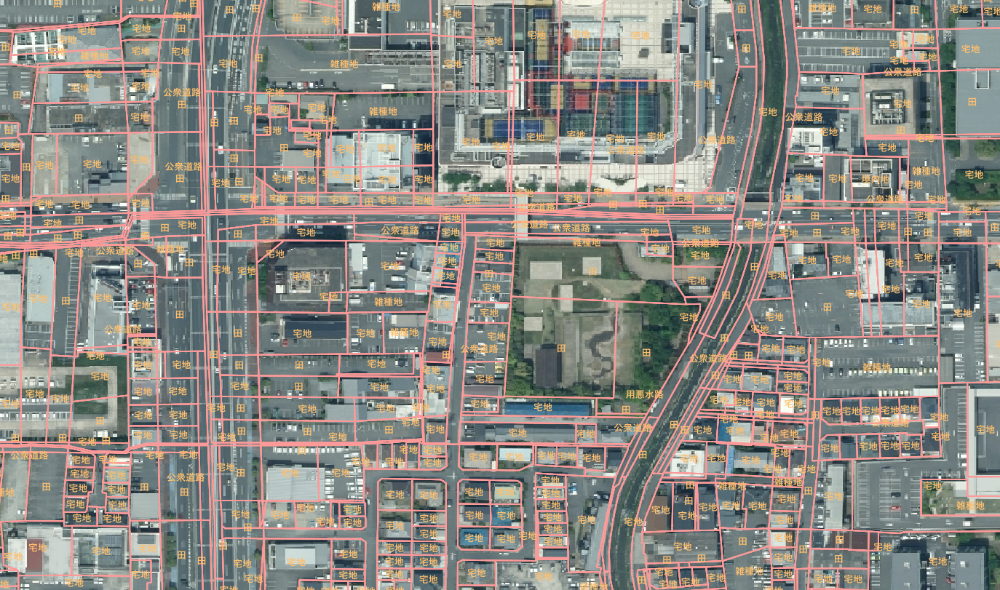

# nara-auto-chimoku-classifier

本プロジェクトは、`nara-land-classifier` で訓練されたモデルを使用し、地図データから推定地目を自動的に分類・GeoJSON形式で出力するユーティリティです。

## ディレクトリ構成

```text
nara-auto-chimoku-classifier/
├── start_chimoku.bat
├── チェック.qgz
├── 2025-05-22_21h38_04.png
│
├── Input/
│   ├── corners.geojson
│   ├── nara_4326.tif
│   └── nara_fudekai_bound.gpkg
│
├── Model/
│   ├── label_map.json
│   └── land_classifier_model.pth
│
├── Output/
│   └── predicted.geojson
│
└── python_src/
    ├── config.ini
    └── land_use_guess_fixed.py
```text
## 実行手順

1. 必要なファイルを `Input/` および `Model/` に配置してください。
2. `start_chimoku.bat` をダブルクリックして実行します。
3. `Output/predicted.geojson` に分類結果が出力されます。
4. `チェック.qgz` を開くことで、`QGIS` 上で結果を可視化できます。

- [nara-land-classifier GitHub リポジトリ](https://github.com/NaohikoMuramatsu2025/nara-land-classifier)


## イメージ参照

以下の画像は、本ユーティリティにおいて分類対象となった地図データの例です。地図上には筆ポリゴン（地番境界）と推定された地目情報が重ねて表示されており、モデルによって自動分類された「宅地」「田」「公衆用道路」「雑種地」などのラベルが確認できます。



この画像は `チェック.qgz` を QGIS 上で開くことで得られる可視化結果の一部であり、推定された地目情報が地理空間的に整合しているかを目視で確認するために活用します。
